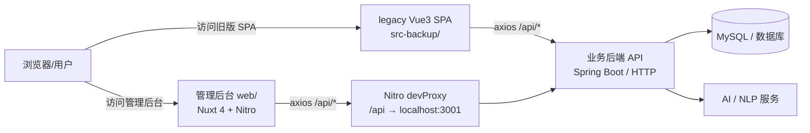

# JOSP-novelCharacterVue3

## 项目简介

JOSP-novelCharacterVue3 是 **JOSP 小说人物管理系统** 的前端仓库，面向小说创作场景提供角色档案管理、关系编排、事件追踪、文本分析与数据可视化能力。

当前仓库包含两套前端实现：

- **`web/`**：基于 **Nuxt 4 + @nuxt/ui v4** 构建的现代化管理后台，使用 Nitro 开发代理转发 API 请求，是当前活跃的开发目标。
- **`src-backup/`**：原 **Vue 3 + Vite + Element Plus** 单页应用实现，已归档保留作为历史参考。

系统通过 RESTful API 与业务后端（Spring Boot / 其他 HTTP 服务）通信，后端再持久化到 MySQL 等数据库，并可调用 AI/NLP 服务完成角色生成与文本分析。

## 系统架构图



## 技术栈

### 当前活跃项目 `web/`

| 技术 | 版本 | 说明 |
|------|------|------|
| [Nuxt](https://nuxt.com/) | 4.4.6 | Vue 全栈框架 |
| [@nuxt/ui](https://ui.nuxt.com/) | 4.7.0 | 现代 UI 组件库 |
| [Vue](https://vuejs.org/) | 3.5.33 | 渐进式 JavaScript 框架 |
| [Vue Router](https://router.vuejs.org/) | 4.5.0 | 官方路由 |
| [Pinia](https://pinia.vuejs.org/) | 2.2.6 | Vue 状态管理 |
| [@vueuse/nuxt](https://vueuse.org/) | 14.2.1 | Vue 组合式工具集 |
| [@element-plus/nuxt](https://element-plus.org/) | 1.1.1 | Element Plus Nuxt 模块 |
| [Tailwind CSS](https://tailwindcss.com/) | 4.x | 原子化 CSS |
| [Axios](https://axios-http.com/) | 1.7.7 | HTTP 客户端 |
| [dayjs](https://day.js.org/) | 1.11.13 | 日期处理 |

### 归档项目（根目录 / `src-backup/`）

| 技术 | 版本 | 说明 |
|------|------|------|
| [Vue](https://vuejs.org/) | 3.5.32 | 渐进式 JavaScript 框架 |
| [Vite](https://vitejs.dev/) | 8.0.8 | 前端构建工具 |
| [Element Plus](https://element-plus.org/) | 2.13.7 | Vue3 UI 组件库 |
| [Pinia](https://pinia.vuejs.org/) | 3.0.4 | Vue3 状态管理 |
| [Vue Router](https://router.vuejs.org/) | 5.0.4 | Vue3 官方路由 |
| [Axios](https://axios-http.com/) | 1.15.2 | HTTP 客户端 |
| [ECharts](https://echarts.apache.org/) | 6.0.0 | 数据可视化库 |
| [Sass](https://sass-lang.com/) | 1.99.0 | CSS 预处理器 |
| [Vant](https://vant-ui.github.io/) | 4.9.24 | 移动端 UI 组件库 |

## 项目结构

```
JOSP-novelCharacterVue3/
├── web/                          # 当前活跃：Nuxt 4 管理后台
│   ├── app/
│   │   ├── app.vue               # 应用根组件
│   │   ├── app.config.ts         # UI 配置
│   │   ├── assets/css/           # 全局样式（main.css / ferrari.css）
│   │   ├── api/                  # Axios API 接口封装
│   │   ├── components/           # 页面级组件
│   │   ├── composables/          # Vue 组合式函数
│   │   ├── layouts/              # Nuxt 布局
│   │   ├── pages/                # 页面路由
│   │   │   ├── index.vue         # 欢迎首页 / 快速入口
│   │   │   ├── home.vue          # 系统总览
│   │   │   ├── dashboard.vue     # 数据看板（ECharts 图表）
│   │   │   ├── library.vue       # 角色库列表
│   │   │   ├── character/create.vue   # 创建角色
│   │   │   ├── character/[id].vue     # 角色详情
│   │   │   ├── analyze.vue       # 小说文本分析
│   │   │   └── settings.vue      # 系统设置
│   │   ├── stores/               # Pinia 状态管理
│   │   └── utils/request.js      # Axios 请求实例
│   ├── public/                   # 静态资源
│   ├── nuxt.config.ts            # Nuxt 配置文件
│   ├── package.json
│   └── pnpm-lock.yaml
│
├── src-backup/                   # 归档：原 Vue 3 + Vite SPA
│   ├── App.vue
│   ├── main.js
│   ├── api/                      # API 接口
│   ├── pages/                    # 页面组件
│   ├── components/               # 页面级组件
│   ├── stores/                   # Pinia 状态
│   ├── router/                   # Vue Router 配置
│   └── utils/request.js
│
├── public/                       # 根目录静态资源
├── package.json                  # 旧版 Vue3 项目依赖
├── package-lock.json
├── pnpm-lock.yaml
├── bun.lock
├── DESIGN.md                     # 设计规范文档
├── LICENSE                       # AGPL-3.0 开源协议
└── README.md                     # 本文件
```

## 启动方式

### 环境要求

- Node.js 18+
- pnpm 8+（推荐）或 npm 10+

### 1. 启动当前活跃项目 `web/`

```bash
cd /Users/junw/Documents/GitHub/novelCharacter/JOSP-novelCharacterVue3/web

# 安装依赖
pnpm install
# 或
npm install

# 启动开发服务器（默认端口 3000）
pnpm dev
# 或
npm run dev

# 构建生产版本
pnpm build
# 或
npm run build

# 预览生产构建
pnpm preview
# 或
npm run preview
```

`web/` 通过 `nuxt.config.ts` 中的 Nitro `devProxy` 将 `/api` 代理到后端服务 `http://localhost:3001`，开发时请确保后端服务已启动。

### 2. 启动归档的 Vue 3 SPA（根目录）

```bash
cd /Users/junw/Documents/GitHub/novelCharacter/JOSP-novelCharacterVue3

# 安装依赖
pnpm install
# 或
npm install

# 启动开发服务器（默认端口 5173）
pnpm dev
# 或
npm run dev

# 构建生产版本
pnpm build
# 或
npm run build
```

> 注意：根目录下的 `src/` 已迁移为 `src-backup/`，原 `package.json` 中的脚本仍指向 `src/`；如需运行旧版 SPA，可能需要先恢复或调整路径配置。

## 开源协议

本项目采用 **GNU Affero General Public License v3.0（AGPL-3.0）** 开源协议，详见仓库根目录下的 [LICENSE](./LICENSE) 文件。
